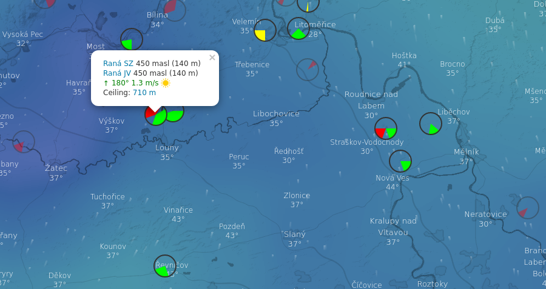

### Windy plugin for paragliding takeoffs

Navigate to https://www.windy.com/plugins, find Paragliding Mapa and click _Open plugin_. Next time in the same browser, you can go to https://www.windy.com/plugin/pgmapa.

This plugin displays paragliding takeoffs from https://www.paragliding-mapa.cz/, https://www.dhv.de/db3/gelaende/, https://paraglidingearth.com/ and https://www.xcontest.org/ and highlights takeoffs with usable wind direction. Matching wind direction and wind under 4 m/s displays in green, almost matching direction (tolerance ±10°) or wind over 4 m/s in yellow and wrong direction or wind over 8 m/s in red. Other data (such as rain or gusts) is not taken into account.
